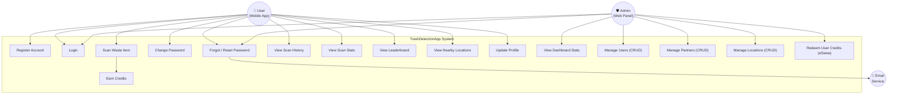
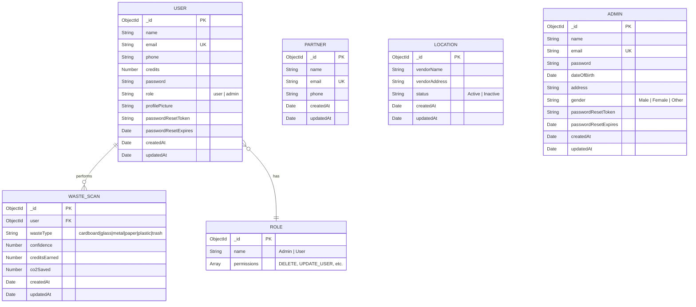
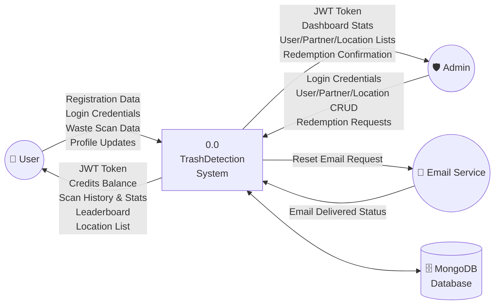
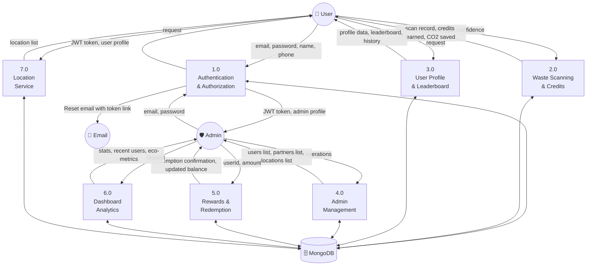
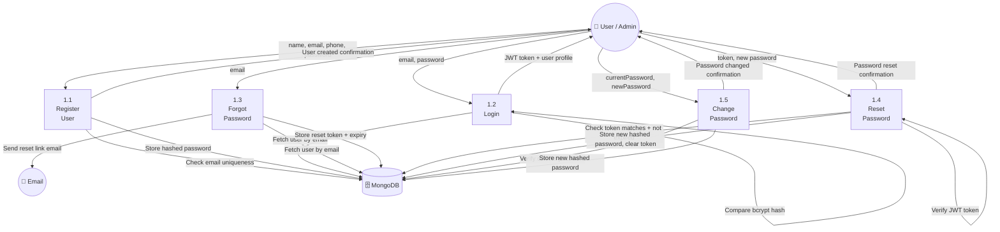
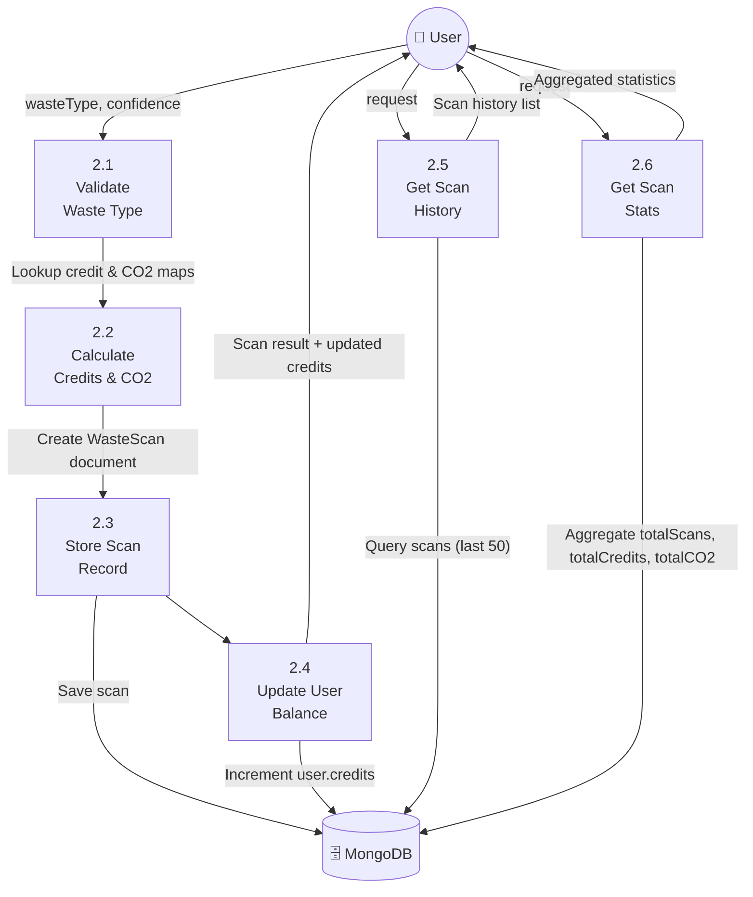
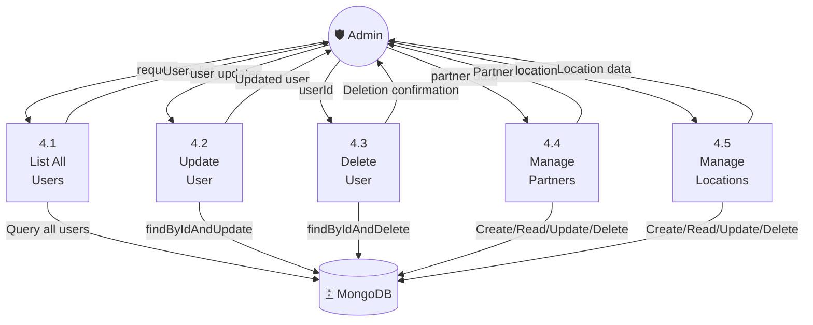
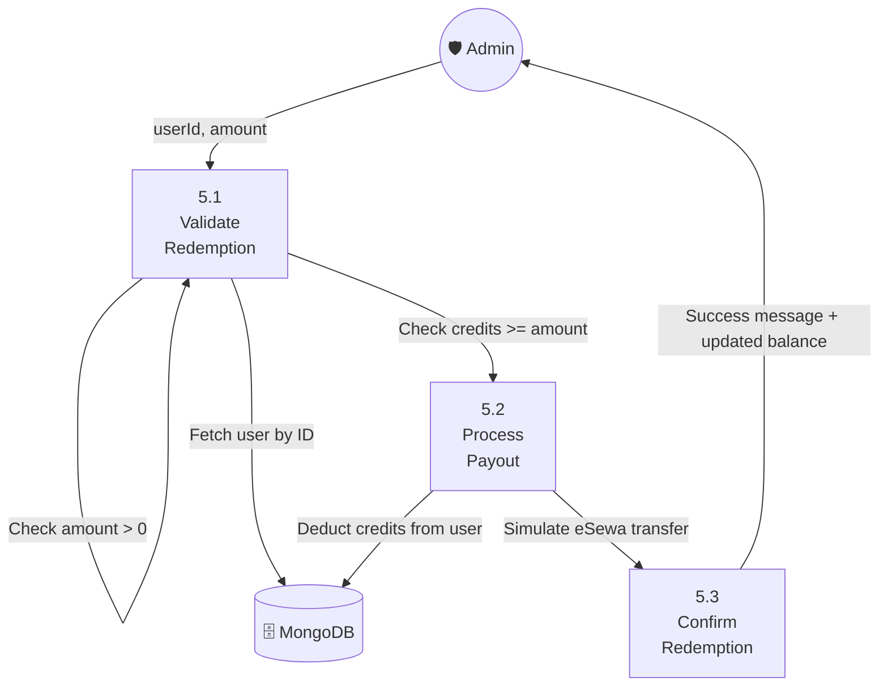

# TrashDetectionApp — System Documentation

**Project:** TrashDetectionApp (Return. Recycle. Reward.)  
**Version:** 1.0  
**Date:** May 2026

---

## 1. System Overview

TrashDetectionApp is a waste management and recycling incentive platform consisting of three components:

| Component | Technology | Purpose |
|-----------|-----------|---------|
| **Mobile App** | Flutter (Dart) | End-users scan waste, earn credits, find recycling locations |
| **Admin Panel** | React + TypeScript (Vite) | Administrators manage users, partners, locations, rewards |
| **Backend API** | Node.js + Express + MongoDB | RESTful API serving both frontends |

**Actors:**
- **User** — A mobile app user who scans waste items using their phone camera, earns credits for recycling, views scan history/stats, checks the leaderboard, and finds nearby recycling locations.
- **Admin** — An administrator who logs into the web-based admin panel to manage users, partners, collection locations, process reward redemptions (eSewa payouts), and view dashboard analytics.
- **System (Email Service)** — Automated email delivery for password reset links via Gmail SMTP.

---

## 2. Use Case Diagram

### 2.1 Use Case Descriptions

#### UC1: Register Account
- **Actor:** User
- **Precondition:** User does not have an existing account.
- **Flow:** User provides name, email, phone, and password. System validates uniqueness of email, hashes the password, creates account with role "user" and 0 credits.
- **Postcondition:** Account created; user can log in.

#### UC2: Login
- **Actor:** User, Admin
- **Precondition:** Account exists.
- **Flow:** Actor provides email and password. System verifies credentials and returns a JWT token (valid for 7 days) along with user profile data.
- **Postcondition:** Actor receives JWT token for authenticated requests.

#### UC3: Forgot / Reset Password
- **Actor:** User, Admin
- **Precondition:** Account exists with a valid email.
- **Flow:** Actor submits email. System generates a JWT reset token (1-hour expiry), stores it on the user record, and sends an email with a reset link. Actor clicks the link, enters a new password, and system updates the stored hash.
- **Postcondition:** Password is updated; reset token is cleared.

#### UC4: Change Password
- **Actor:** User (authenticated)
- **Precondition:** User is logged in.
- **Flow:** User provides current password and new password (min 6 chars). System verifies current password, hashes the new one, and updates.
- **Postcondition:** Password changed.

#### UC5: Scan Waste Item
- **Actor:** User
- **Precondition:** User is authenticated.
- **Flow:** User captures a photo via the mobile camera. The app identifies the waste type (cardboard, glass, metal, paper, plastic, trash) with a confidence score. The result is sent to the backend.
- **Postcondition:** WasteScan record created; credits added to user balance.

#### UC6: Earn Credits
- **Actor:** System (triggered by UC5)
- **Flow:** Based on the waste type, credits are calculated from a predefined credit map (paper=1, cardboard=2, plastic=3, glass=4, metal=5, trash=1 Rs.) and CO2 savings are recorded. User's credit balance is incremented.
- **Credit Map:**

| Waste Type | Credits (Rs.) | CO2 Saved (g) |
|-----------|--------------|---------------|
| Paper | 1 | 100 |
| Cardboard | 2 | 150 |
| Plastic | 3 | 250 |
| Glass | 4 | 200 |
| Metal | 5 | 300 |
| Trash | 1 | 50 |

#### UC7: View Scan History
- **Actor:** User
- **Flow:** Returns the user's last 50 waste scan records sorted by date (newest first).

#### UC8: View Scan Stats
- **Actor:** User
- **Flow:** Aggregates user's total scans, total credits earned, and total CO2 saved.

#### UC9: View Leaderboard
- **Actor:** User
- **Flow:** Returns the top 10 users (role=user) sorted by credits descending, showing name, credits, and profile picture.

#### UC10: View Nearby Locations
- **Actor:** User
- **Flow:** Retrieves all active recycling collection locations with vendor name and address.

#### UC11: Update Profile
- **Actor:** User
- **Flow:** User updates name, phone, or profile picture.

#### UC12: View Dashboard Stats
- **Actor:** Admin
- **Flow:** Retrieves total user count, eco-metrics (recycled waste, CO2 saved, rewards earned), and the 5 most recently registered users.

#### UC13: Manage Users (CRUD)
- **Actor:** Admin
- **Flow:** Admin can list all users, view individual user details, update user information, or delete user accounts. Requires admin role.

#### UC14: Manage Partners (CRUD)
- **Actor:** Admin
- **Flow:** Admin can create, list, update, or delete partner organizations (name, email, phone).

#### UC15: Manage Locations (CRUD)
- **Actor:** Admin
- **Flow:** Admin can create, list, update, or delete recycling collection locations (vendor name, address, status: Active/Inactive).

#### UC16: Redeem User Credits (eSewa)
- **Actor:** Admin
- **Flow:** Admin selects a user, specifies an amount to redeem. System validates the user has sufficient credits, deducts the amount, and simulates an eSewa payout.
- **Postcondition:** User's credit balance is reduced by the redeemed amount.

---

## 3. Entity-Relationship (ER) Diagram

### 3.1 Entity Descriptions

| Entity | Description | Key Attributes |
|--------|------------|----------------|
| **User** | End-users and admins of the platform. The `role` field distinguishes between "user" and "admin". Password is excluded from default queries (`select: false`). | email (unique), role, credits |
| **WasteScan** | Each record represents one waste scanning event. Links to the User who performed it. Stores the detected waste type, AI confidence score, credits earned, and CO2 saved. | user (FK → User), wasteType, creditsEarned |
| **Partner** | Organizations that partner with the platform for recycling collection or reward programs. | email (unique) |
| **Location** | Physical recycling/collection points managed by vendors. Can be toggled Active/Inactive. | vendorName, status |
| **Role** | Defines named roles with permission arrays (e.g., DELETE, UPDATE_USER). Used for RBAC. | name, permissions[] |
| **Admin** | Separate admin profile model with extended fields (DOB, address, gender). Has its own password reset fields. | email (unique), gender |

### 3.2 Relationships

| Relationship | Cardinality | Description |
|-------------|-------------|-------------|
| User → WasteScan | 1 : N | One user can have many waste scan records. Each scan belongs to exactly one user. |
| User → Role | N : 1 | Each user has one role (stored as a string enum: "user" or "admin"). The Role collection provides additional permission metadata. |

---

## 4. Data Flow Diagrams (DFD)

### 4.1 DFD Level 0 — Context Diagram

The context diagram shows the entire TrashDetectionApp as a single process with its external entities and data flows.

**External Entities:**
- **User** — Interacts via the Flutter mobile app
- **Admin** — Interacts via the React admin panel
- **Email Service** — Gmail SMTP used for password reset emails
- **MongoDB Database** — Persistent data store (MongoDB Atlas)

---

### 4.2 DFD Level 1 — Major Processes

Decomposes the system into its major functional processes.

#### Process Descriptions

| Process | Description | Input | Output |
|---------|------------|-------|--------|
| **1.0 Authentication** | Handles registration, login, forgot password (email), reset password, change password. Issues JWT tokens. | Credentials, email | JWT token, profile, reset email |
| **2.0 Waste Scanning** | Receives waste type + confidence from mobile camera AI, calculates credits and CO2, creates scan record, updates user balance. | wasteType, confidence | Scan record, credits, CO2 |
| **3.0 User Profile** | Returns current user's profile, scan history, scan stats, and leaderboard. | JWT token | Profile, history, stats, leaderboard |
| **4.0 Admin Management** | CRUD operations for users, partners, and locations. Requires admin role. | CRUD data | Entity lists, confirmations |
| **5.0 Rewards & Redemption** | Admin redeems a user's credits via simulated eSewa payout. Validates balance sufficiency. | userId, amount | Confirmation, updated balance |
| **6.0 Dashboard Analytics** | Aggregates platform-wide statistics for the admin dashboard. | Request | Stats, recent users |
| **7.0 Location Service** | Returns all recycling collection locations for mobile app users. | Request | Location list |

---

### 4.3 DFD Level 2 — Process Decomposition

#### 4.3.1 Process 1.0: Authentication & Authorization (Decomposed)

**Data Stores accessed:** User collection  
**Security:** Passwords hashed with bcrypt (10 rounds). JWT signed with `JWT_SECRET`, 7-day expiry for login, 1-hour expiry for reset tokens.

---

#### 4.3.2 Process 2.0: Waste Scanning & Credits (Decomposed)

**Data Stores accessed:** WasteScan collection, User collection  
**Business Rules:**
- Only 6 valid waste types: cardboard, glass, metal, paper, plastic, trash
- Credits and CO2 are determined by predefined lookup maps
- User balance is atomically incremented using MongoDB `$inc`

---

#### 4.3.3 Process 4.0: Admin Management (Decomposed)

**Authorization:** All admin management routes require:
1. Valid JWT (authentication middleware)
2. `role === "admin"` (role authorization middleware)

---

#### 4.3.4 Process 5.0: Rewards & Redemption (Decomposed)

**Business Rules:**
- Redemption amount must be positive
- User must have sufficient credits (credits >= amount)
- Credits are deducted atomically
- eSewa payout is currently simulated (not integrated with actual eSewa API)

---

## 5. API Endpoint Summary

| Method | Endpoint | Auth | Role | Description |
|--------|---------|------|------|-------------|
| POST | `/api/auth/register` | — | — | Register new user |
| POST | `/api/auth/login` | — | — | Login and receive JWT |
| POST | `/api/auth/forgot-password` | — | — | Send password reset email |
| POST | `/api/auth/reset-password/:token` | — | — | Reset password with token |
| POST | `/api/auth/change-password` | ✅ | — | Change password (logged in) |
| GET | `/api/users/me` | ✅ | — | Get current user profile |
| GET | `/api/users/leaderboard` | ✅ | — | Get top 10 leaderboard |
| GET | `/api/users` | ✅ | admin | List all users |
| GET | `/api/users/:id` | ✅ | — | Get single user |
| PUT | `/api/users/:id` | ✅ | — | Update user |
| DELETE | `/api/users/:id` | ✅ | admin | Delete user |
| POST | `/api/users/:id/redeem` | ✅ | admin | Redeem user credits |
| POST | `/api/waste/scan` | ✅ | — | Scan waste and earn credits |
| GET | `/api/waste/history` | ✅ | — | Get user's scan history |
| GET | `/api/waste/stats` | ✅ | — | Get user's scan statistics |
| GET | `/api/admin/stats` | — | — | Get dashboard statistics |
| POST | `/api/partners` | — | — | Create partner |
| GET | `/api/partners` | — | — | List all partners |
| PUT | `/api/partners/:id` | — | — | Update partner |
| DELETE | `/api/partners/:id` | — | — | Delete partner |
| POST | `/api/locations` | — | — | Create location |
| GET | `/api/locations` | — | — | List all locations |
| PUT | `/api/locations/:id` | — | — | Update location |
| DELETE | `/api/locations/:id` | — | — | Delete location |

---

## 6. Data Dictionary

| Field | Type | Constraints | Description |
|-------|------|------------|-------------|
| `User.name` | String | Required | Full name of the user |
| `User.email` | String | Required, Unique | Email address used for login |
| `User.phone` | String | Default: "" | Contact phone number |
| `User.credits` | Number | Default: 0 | Accumulated recycling reward balance (Rs.) |
| `User.password` | String | Required, select:false | Bcrypt-hashed password (never returned in queries) |
| `User.role` | String | Enum: user, admin. Default: user | Authorization role |
| `User.profilePicture` | String | Default: "" | URL to profile image |
| `WasteScan.user` | ObjectId | Required, ref: User | Foreign key to the scanning user |
| `WasteScan.wasteType` | String | Enum: 6 types, Required | Detected waste material category |
| `WasteScan.confidence` | Number | Required | AI detection confidence (0-1) |
| `WasteScan.creditsEarned` | Number | Required | Credits awarded for this scan |
| `WasteScan.co2Saved` | Number | Default: 0 | Estimated CO2 savings in grams |
| `Partner.name` | String | Required | Partner organization name |
| `Partner.email` | String | Required, Unique | Partner contact email |
| `Location.vendorName` | String | Required | Name of the collection point vendor |
| `Location.vendorAddress` | String | Required | Physical address |
| `Location.status` | String | Enum: Active, Inactive | Whether the location is currently operational |
